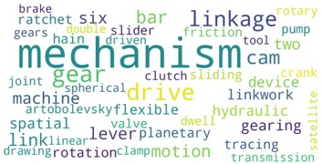

# A Dataset for Mechanical Mechanisms## Introduction
This repository contains a dataset of approximately 9,000 images and corresponding descriptions of mechanical mechanisms. The dataset is intended to support research in mechanism design, particularly in the application of generative AI models such as Stable Diffusion and BLIP-2 for generating and captioning mechanical designs.

## Dataset Overview
The dataset includes:
-**3D Sketches**: 4,852 images
-**2D Sketches**: 4,142 images

The images were sourced from:
- A YouTube channel focused on mechanical design [Reference](#).
- A digital library dedicated to mechanisms and gears [Reference](#).
- A book with a vast collection of 2D sketches of mechanical mechanisms [Reference](#).

## Links to the Dataset
-**256x256 Resolution Images**: [Link to Google Drive](https://drive.google.com/file/d/1yC6nKih8HcAAoKCVM-Lo6bxGQ2O8T5-_/view?usp=sharing)
-**High-Resolution Images**: [Link to Google Drive](https://drive.google.com/file/d/1jqSKDypbN3vfGBA2SnUuQLuSnZC3BPYh/view?usp=sharing)

## Applications
The dataset has been used to fine-tune two AI models:
1.**Stable Diffusion**: Fine-tuned for generating new mechanical designs. While the model performs well with 3D sketches, it struggles with 2D sketches, sometimes producing nonsensical outputs.
2.**BLIP-2**: Fine-tuned for generating captions for mechanical designs. The results are mixed, with the model occasionally producing inaccurate captions due to limited training epochs.

## Structure of the Repository-**data/**: Contains the dataset links and other relevant files.
-**notebooks/**: Jupyter notebooks used for fine-tuning models and generating results.
-**figures/**: Contains the figures.
-**doc/**: Contains the project documentation, including the PDF version of the work.

## Limitations and Future Work
- The dataset size is relatively small, which limits the model's ability to generalize across diverse mechanical designs.
- Future work includes expanding the dataset, refining model architectures, and applying the models to real-world design challenges.

## Responsibility of Use
All data included in this dataset was collected from publicly available sources. Users are strongly encouraged to cite the corresponding references and use the dataset ethically and in accordance with applicable laws.
